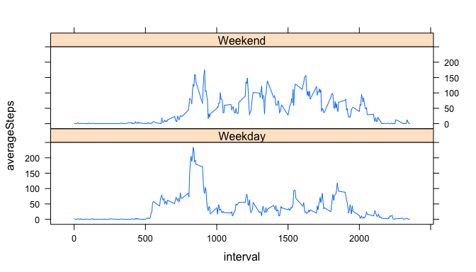

# Reproducible Research: Peer Assessment 1


## Loading and preprocessing the data
Ensure that the activity.zip file is the working directory

```r
data <- read.csv(unz("activity.zip","activity.csv"))
```
## What is mean total number of steps taken per day?

Calculate the daily total

```r
library(dplyr)
```

```
## 
## Attaching package: 'dplyr'
## 
## The following objects are masked from 'package:stats':
## 
##     filter, lag
## 
## The following objects are masked from 'package:base':
## 
##     intersect, setdiff, setequal, union
```

```r
dailytotal <- data %>%
              group_by(date) %>%
              summarise(dailytotal=sum(steps, na.rm=TRUE))
```

Plot the daily total in a histogram

```r
hist(dailytotal$dailytotal,xlab="Total Steps",ylab="Frequency (number of days)",
     main="Total steps taken each day")
```

 

The mean and median total number of steps taken per day

```r
summarise(dailytotal, mean(dailytotal),median(dailytotal))
```

```
## Source: local data frame [1 x 2]
## 
##   mean(dailytotal) median(dailytotal)
## 1          9354.23              10395
```

## What is the average daily activity pattern?

Calculate the average per interval

```r
fiveMinsInterval <- data %>%
                group_by(interval) %>%
                summarise(dailyaverage=mean(steps, na.rm=TRUE))
```

Plot of average number of steps taken per interval

```r
plot(x=fiveMinsInterval$interval,
     y=fiveMinsInterval$dailyaverage, 
     type="l",
     xlab="Five minute interval",
     ylab="Average number of steps (across all days)",
     main="Time series plot (5-minute interval and average number of steps")
```

 

The 5-minute interval which contains the maximum number of steps

```r
filter(fiveMinsInterval, dailyaverage == max(dailyaverage))
```

```
## Source: local data frame [1 x 2]
## 
##   interval dailyaverage
## 1      835     206.1698
```

## Imputing missing values

Count the number of incomplete cases

```r
nrow(data[!complete.cases(data),])
```

```
## [1] 2304
```

Strategy for imputing missing data - use mean value of the steps 

```r
imputedData <- data
imputedData$step[is.na(imputedData$step)] <- mean(imputedData$step, na.rm = TRUE)
```

Using the imputed data, calculate the daily total

```r
estimateddailytotal <- imputedData %>%
              group_by(date) %>%
              summarise(dailytotal=sum(steps, na.rm=TRUE))
```

Plot the daily total from the imputed data in a histogram

```r
hist(estimateddailytotal$dailytotal,xlab="Total Steps",ylab="Frequency (number of days)",
     main="Estimated total steps taken each day")
```

 

The mean and median of the estimated data set

```r
summarise(estimateddailytotal, mean(dailytotal),median(dailytotal))
```

```
## Source: local data frame [1 x 2]
## 
##   mean(dailytotal) median(dailytotal)
## 1          9354.23              10395
```

The mean and median of the imputed daily total do not appear to be different from those calculated without the imputed values

## Are there differences in activity patterns between weekdays and weekends?

Create a new category for Weekend/Weekday on the imputed dataset

```r
library(lubridate)
library(lattice)
imputedData$category <- ifelse(weekdays(ymd(imputedData$date)) %in% c("Sunday","Saturday"), "Weekend","Weekday")

imputedData$category <- as.factor(imputedData$category)
```

Work out the average number of steps taken per 5-minute interval, averaged across the category

```r
averagedWeekendWeekday <- imputedData %>%
                          group_by(category, interval) %>%
                          summarise(averageSteps=mean(steps, na.rm=TRUE))
```

Plot the average steps against interval in a panel plot

```r
xyplot(averageSteps ~ interval | category, data = averagedWeekendWeekday, layout = c(1,2), type="l")
```

 
